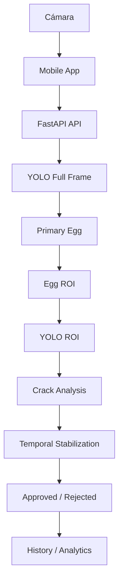

# 🥚 EggVision

**Sistema inteligente para detección y clasificación de huevos mediante visión artificial.**

[](https://www.python.org/)
[](https://fastapi.tiangolo.com/)
[](https://docs.ultralytics.com/)
[](https://expo.dev/)
[](https://aws.amazon.com/ec2/)

EggVision integra una **aplicación móvil en React Native + Expo**, un **backend FastAPI** que
sirve un modelo **YOLOv8n** desplegado en una instancia **AWS EC2**, para detectar un huevo,
analizar posibles grietas y clasificarlo automáticamente como **aprobado** o **rechazado**,
con historial y analítica de las inspecciones realizadas.

---

## Tabla de contenido

1. [Objetivo del proyecto](#objetivo-del-proyecto)
2. [Funcionalidades actuales](#funcionalidades-actuales)
3. [Arquitectura](#arquitectura)
4. [Modelo de visión artificial](#modelo-de-visión-artificial)
5. [Inferencia en dos etapas](#inferencia-en-dos-etapas)
6. [Flujo de inspección](#flujo-de-inspección)
7. [Frontend](#frontend)
8. [Métricas del modelo](#métricas-del-modelo)
9. [Dataset](#dataset)
10. [Tecnologías](#tecnologías)
11. [Estructura del proyecto](#estructura-del-proyecto)
12. [Ejecución local](#ejecución-local)
13. [Tests](#tests)
14. [Despliegue](#despliegue)
15. [Limitaciones](#limitaciones)
16. [Trabajo futuro](#trabajo-futuro)
17. [Capturas](#capturas)
18. [Autor](#autor)
19. [Licencia / uso](#licencia--uso)

---

## Objetivo del proyecto

EggVision fue desarrollado como proyecto académico de la asignatura **Ciencia de Datos**
(Ingeniería de Sistemas) para simular, de forma realista, un sistema automatizado de
inspección de huevos.

**Objetivo principal:** detectar automáticamente la presencia de un huevo, analizar posibles
grietas en su cáscara y clasificarlo como **aprobado** o **rechazado**.

El sistema está **optimizado actualmente para inspeccionar un huevo por vez**, centrado en el
huevo principal visible en cámara. No procesa múltiples huevos simultáneos ni una banda
transportadora real.

## Funcionalidades actuales

Lo siguiente **ya está implementado y funcionando**:

- 📷 Captura continua mediante la cámara del dispositivo (Auto Scan configurable).
- 🥚 Detección del huevo principal en la escena.
- 🩹 Detección de grietas asociadas a ese huevo.
- ✅ Clasificación automática **aprobado / rechazado**.
- 🧠 Estabilización temporal del resultado (evita parpadeo entre frames).
- 🔁 Inferencia en dos etapas (imagen completa + recorte ROI del huevo) para mejorar la
  detección de grietas pequeñas.
- 🗂️ Historial local de inspecciones, con filtros (Todos / Aprobados / Rechazados).
- 📊 Analítica de inspecciones (totales, % aprobación/rechazo, tiempos).
- 💾 Almacenamiento local con AsyncStorage (sin backend adicional para el historial).
- ☁️ Backend de inferencia desplegado en una instancia AWS EC2.

> **Nota de alcance:** EggVision no detecta múltiples huevos simultáneos, manchas, suciedad,
> tamaño/calibre ni tipo de huevo (criollo/semicriollo). Esas ideas se documentan como
> [trabajo futuro](#trabajo-futuro), no como funcionalidades terminadas.

## Arquitectura

**Mobile**
- React Native + Expo
- TypeScript
- Expo Router
- Expo Camera
- AsyncStorage

**Backend**
- Python
- FastAPI + Uvicorn
- Pydantic
- Ultralytics YOLO

**Infraestructura**
- AWS EC2
- GitHub



## Modelo de visión artificial

| | |
| --- | --- |
| Modelo | YOLOv8n |
| Clases | `egg`, `crack` |
| Resolución de entrenamiento | `imgsz=960` |
| Dataset principal | INDIGO Crack Detection |

El modelo se entrenó y evaluó sobre el dataset INDIGO (ver [Dataset](#dataset)) y luego se
integró en la aplicación móvil a través del backend FastAPI. Sobre esa integración se agregó
una segunda inferencia sobre el recorte (ROI) del huevo principal, para reforzar la detección
de grietas sin modificar el modelo ni reentrenarlo.

El modelo solo reconoce lo que fue entrenado para reconocer: **huevo** y **grieta**. No infiere
atributos adicionales (suciedad, tamaño, tipo, etc.).

## Inferencia en dos etapas

Este es el diferenciador técnico actual del backend: el **mismo modelo YOLO** se ejecuta dos
veces por imagen para mejorar la resolución efectiva de grietas pequeñas.

1. **Etapa 1** — YOLO analiza la imagen completa (*full frame*).
2. **Etapa 2** — Se selecciona el huevo principal (*primary egg*) entre las detecciones.
3. **Etapa 3** — Se calcula un recorte (ROI) alrededor de ese huevo, con un padding de
   expansión y clamp a los límites de la imagen.
4. **Etapa 4** — El mismo modelo YOLO vuelve a analizar únicamente ese recorte.
5. **Etapa 5** — Las grietas encontradas en el ROI se remapean a coordenadas de la imagen
   original.
6. **Etapa 6** — La evidencia de grietas de la imagen completa y del ROI se combina,
   eliminando duplicados por superposición (IoU).
7. **Etapa 7** — La estabilización temporal (varios frames consecutivos) decide el estado
   final: aprobado o rechazado.

Esta segunda pasada es configurable por variables de entorno del backend y puede
desactivarse sin afectar el resto del sistema si fuera necesario.

## Flujo de inspección

```
Cámara
  ↓
Captura automática
  ↓
Preprocesamiento
  ↓
API FastAPI
  ↓
YOLO imagen completa
  ↓
Huevo principal
  ↓
YOLO sobre ROI
  ↓
Detección de grietas
  ↓
Estabilización temporal
  ↓
Aprobado / Rechazado
  ↓
Historial + Analytics
```

## Frontend

La aplicación móvil tiene cuatro pantallas principales:

**Home**
- Resumen general de inspecciones del día.
- Acceso directo a iniciar una inspección.

**Scan**
- Cámara en vivo con una zona de inspección fija.
- Interruptor de Auto Scan.
- Estados visibles: *Buscando*, *Analizando*, *Aprobado*, *Rechazado*.

**History**
- Historial de inspecciones realizadas.
- Filtros: Todos / Aprobados / Rechazados.

**Analytics**
- Total de inspecciones.
- Aprobados y rechazados.
- Porcentaje de aprobación y de rechazo.
- Tiempo promedio de análisis.

> **Sobre la cámara:** la interfaz final **no muestra los bounding boxes crudos del modelo**
> (su localización aún puede variar). En su lugar se muestra una **zona visual de
> inspección** fija, pensada para guiar el encuadre del huevo — no se presenta como una caja
> generada por IA, sino como una guía de la interfaz.

## Métricas del modelo

Métricas del modelo `yolov8n` a `imgsz=960`, medidas sobre el conjunto de **test** del
dataset INDIGO (`evaluation/yolov8n_960/training_summary.json`).

**General**

| Métrica | Valor |
| --- | --- |
| Precision | 0.90936 |
| Recall | 0.83019 |
| mAP50 | 0.88446 |
| mAP50-95 | 0.70730 |

**Clase `crack`**

| Métrica | Valor |
| --- | --- |
| Precision | 0.83463 |
| Recall | 0.66038 |
| mAP50 | 0.77562 |
| mAP50-95 | 0.42130 |

## Dataset

**INDIGO Crack Detection**

- 840 imágenes reales.
- 740 imágenes en la partición de entrenamiento original.
- 100 imágenes en la partición de test.
- Anotaciones en formato Pascal VOC.
- Clases: `egg`, `crack`.
- Licencia: **CC BY 4.0**.
- DOI: [`10.6084/m9.figshare.21568425.v1`](https://doi.org/10.6084/m9.figshare.21568425.v1)

## Tecnologías

**AI / Data Science**
- Python
- YOLOv8n (Ultralytics)
- Google Colab

**Backend**
- FastAPI
- Uvicorn
- Pydantic

**Mobile**
- React Native
- Expo
- TypeScript
- Expo Router
- Expo Camera
- AsyncStorage

**Cloud / DevOps**
- AWS EC2
- Git / GitHub

## Estructura del proyecto

```
backend/
  app/
    api/
    core/
    schemas/
    services/
  models/
  tests/

mobile/
  app/
  src/
    components/
    constants/
    hooks/
    services/
    types/
    utils/
  assets/

README.md
```

## Ejecución local

**Backend**

```powershell
python -m venv .venv

# Windows
.venv\Scripts\Activate.ps1

# Linux/macOS
source .venv/bin/activate

pip install -r backend/requirements.txt

uvicorn backend.app.main:app --host 0.0.0.0 --port 8080
```

**Mobile**

```bash
cd mobile
npm install
npx expo start
```

Configurar en `mobile/.env`:

```
EXPO_PUBLIC_API_URL=http://IP_BACKEND:8080
```

## Tests

**Backend**

```bash
python -m pytest backend/tests -q
```

**Mobile**

```bash
cd mobile
npm test
npm run typecheck
npx expo-doctor
```

Existen pruebas automatizadas para: clasificación, selección del huevo principal, inferencia
en dos etapas (ROI), lógica temporal, transformación de bounding boxes, tracker de huevo y
cooldown de historial. El número exacto de pruebas evoluciona junto con el código.

## Despliegue

El backend está desplegado en una instancia **AWS EC2**, ejecutado como servicio con
**systemd + Uvicorn**, expuesto actualmente en el puerto **8080**.

El checkpoint del modelo (`best.pt`) se maneja **fuera de Git** (no se versiona el binario del
modelo). Las credenciales, IPs, llaves `.pem` y archivos `.env` reales son locales a cada
entorno y no se publican en este repositorio.

## Limitaciones

- Actualmente optimizado para inspeccionar **un huevo por vez**.
- El desempeño depende de la iluminación, el ángulo y la distancia de la cámara al huevo.
- El modelo reconoce únicamente las clases `egg` y `crack`.
- La localización exacta de los bounding boxes del modelo todavía puede variar entre frames.
- La interfaz prioriza la **estabilidad de la clasificación** sobre la visualización de cajas
  del modelo.
- La combinación Expo Go + backend en AWS no ofrece captura a 30 FPS.
- La latencia percibida depende de la captura en el dispositivo, la red y el tiempo de
  inferencia (que aumenta al activar la segunda etapa sobre el ROI).

## Trabajo futuro

- Fine-tuning con imágenes reales capturadas desde iPhone.
- Detección de múltiples huevos simultáneos.
- Detección de suciedad y manchas.
- Clasificación por tamaño/calibre.
- Tracking sobre banda transportadora.
- Optimización de latencia de inferencia.
- Procesamiento de video en lugar de frames periódicos.
- HTTPS en el backend.
- Infraestructura de despliegue más robusta.
- Ampliación del dataset propio.

## Capturas

_Pendiente de agregar capturas de pantalla de la aplicación final._

| Pantalla | Ruta esperada |
| --- | --- |
| Home | `assets/readme/home.png` |
| Scan — aprobado | `assets/readme/scan-approved.png` |
| Scan — rechazado | `assets/readme/scan-rejected.png` |
| History | `assets/readme/history.png` |
| Analytics | `assets/readme/analytics.png` |

## Autor

**Miguel Ángel Solano Díaz**
Ingeniería de Sistemas
Universidad Autónoma de Bucaramanga — UNAB

## Licencia / uso

Proyecto desarrollado con **fines académicos**. Este repositorio no incluye un archivo
`LICENSE` propio para el código.

El dataset **INDIGO Crack Detection** se distribuye bajo licencia **CC BY 4.0**
(DOI [`10.6084/m9.figshare.21568425.v1`](https://doi.org/10.6084/m9.figshare.21568425.v1)).
